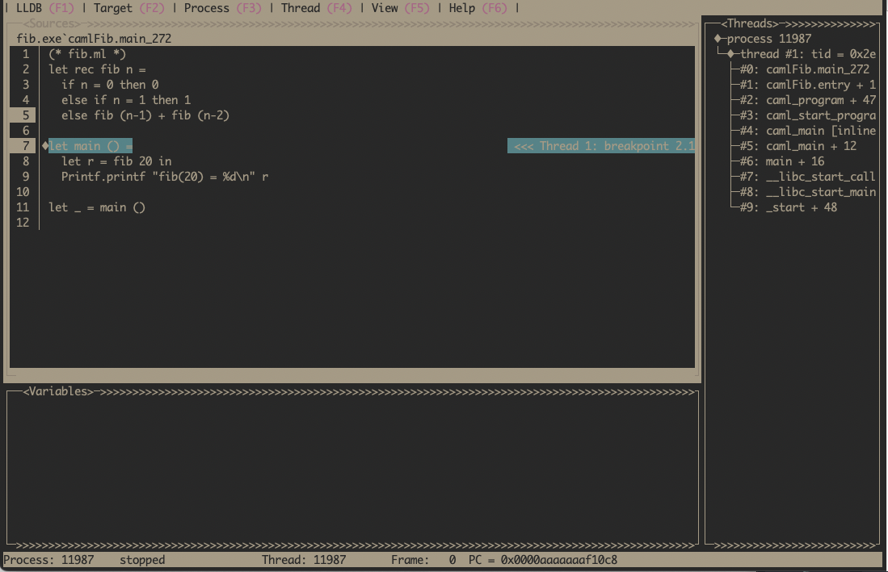

This post is a companion to KC's excellent [Getting Started with GDB on OCaml](https://kcsrk.info/ocaml/gdb/2024/01/20/gdb-ocaml/) that shows how to debug OCaml programs with GDB. I wanted to demonstrate the same functionality using LLDB on Linux ARM64. The aim is to show the beginnings of debugging OCaml programs with LLDB and highlight a few LLDB tricks I've found.

We will start with the same program:

``` ocaml
(* fib.ml *)
let rec fib n =
  if n = 0 then 0
  else if n = 1 then 1
  else fib (n-1) + fib (n-2)

let main () =
  let r = fib 20 in
  Printf.printf "fib(20) = %d\n" r

let _ = main ()
```

Compiled with OCaml version 5.2.0.

``` shell
$ ocamlopt --version
5.2.0
$ ocamlopt -g -o fib.exe fib.ml
$ ./fib.exe 20
fib(20) = 6765
```
The program prints the 20th Fibonacci number, nothing special but interesting because it has recursion. Now start up an lldb session.

``` shell
$ lldb ./fib.exe
```

## Setting breakpoints

We want to set breakpoints in the `fib` function. The first way to set breakpoints is based on OCaml function names, due to a process called name mangling, they look slightly different in the executable. Since we don't know the exact names we can use tab completion to help us.

``` shell
(lldb) br s -n camlFib.fib_ # press tab to show the possible matches
(lldb) br s -n camlFib.fib_270 # There is only one matching ending 270
Breakpoint 1: where = fib.exe`camlFib.fib_270 + 76, address = 0x0000000000051084
```

You can also set break points using lldb's file name and number combination. This time we will set a breakpoint in the `main` function, which starts at line 6 in `fib.ml`.

``` shell
(lldb) br s -f fib.ml -l 6
Breakpoint 2: where = fib.exe`camlFib.main_271, address = 0x0000000000050f48
(lldb)
```

Now we can run the program.

``` shell
Breakpoint 2: where = fib.exe`camlFib.main_272, address = 0x00000000000510c8
(lldb) run
Process 11987 launched: '/home/tsmc/projects/fib.exe' (aarch64)
Process 11987 stopped
* thread #1, name = 'fib.exe', stop reason = breakpoint 2.1
    frame #0: 0x0000aaaaaaaf10c8 fib.exe`camlFib.main_272 at fib.ml:7
   4   	  else if n = 1 then 1
   5   	  else fib (n-1) + fib (n-2)
   6   	
-> 7   	let main () =
   8   	  let r = fib 20 in
   9   	  Printf.printf "fib(20) = %d\n" r
   10  	
```

The program execution starts in the lldb session and we stop at the breakpoint at `main`. LLDB has a terminal UI mode for stepping through the file. This can be started up typing `gui` into the `lldb` prompt, it should look similar to this.



Note that we can see both breakpoints highlighted on the line numbers, the backtrace of how we got here and the current line is highlighted. Use `Esc` to exit the terminal UI mode and go back to the lldb prompt. We will use the lldb prompt for the rest of the post.

## Examining the stack

You can step through the OCaml program with lldb commands `n` and `s`. After a few `n`'s, examine the backtrace using the `bt` command.
``` shell
(lldb) bt
* thread #1, name = 'fib.exe', stop reason = breakpoint 1.1
  * frame #0: 0x0000aaaaaaaf1084 fib.exe`camlFib.fib_270 at fib.ml:5
    frame #1: 0x0000aaaaaaaf108c fib.exe`camlFib.fib_270 at fib.ml:5
    frame #2: 0x0000aaaaaaaf108c fib.exe`camlFib.fib_270 at fib.ml:5
    frame #3: 0x0000aaaaaaaf108c fib.exe`camlFib.fib_270 at fib.ml:5
    frame #4: 0x0000aaaaaaaf10f4 fib.exe`camlFib.main_272 at fib.ml:8
    frame #5: 0x0000aaaaaaaf11bc fib.exe`camlFib.entry at fib.ml:11
    frame #6: 0x0000aaaaaaaee684 fib.exe`caml_program + 476
    frame #7: 0x0000aaaaaab46b48 fib.exe`caml_start_program + 132
    frame #8: 0x0000aaaaaab46640 fib.exe`caml_main [inlined] caml_startup(argv=<unavailable>) at startup_nat.c:145:7
    frame #9: 0x0000aaaaaab4663c fib.exe`caml_main(argv=<unavailable>) at startup_nat.c:151:3
    frame #10: 0x0000aaaaaaaee310 fib.exe`main(argc=<unavailable>, argv=<unavailable>) at main.c:37:3
    frame #11: 0x0000fffff7d784c4 libc.so.6`__libc_start_call_main(main=(fib.exe`main at main.c:31:1), argc=1, argv=0x0000fffffffffb58) at libc_start_call_main.h:58:16
    frame #12: 0x0000fffff7d78598 libc.so.6`__libc_start_main_impl(main=0x0000aaaaaaba0de0, argc=16, argv=0x000000000000000f, init=<unavailable>, fini=<unavailable>, rtld_fini=<unavailable>, stack_end=<unavailable>) at libc-start.c:360:3
    frame #13: 0x0000aaaaaaaee3b0 fib.exe`_start + 48
```

You can see the backtrace includes the recursive calls to `fib` function, the `main` function in `fib.ml`, followed by some assembly functions and a number of functions from the OCaml runtime. In between frame #8 and #5 is where the runtime, written in C, switches into assembly to setup the environment to execute the OCaml program. Then we actually enter the OCaml program at frame #5 via `camlFib.entry`. This function calls initialisation functions for the program and any dependencies like Stdlib that get used.

## Examining values

The support for examining OCaml values in LLDB, as you would for say C, is a bit lacking. Not enough information is being emitted by the OCaml compiler to do this yet. So we need to understand how OCaml represents values at runtime and what the OCaml calling conventions are. First we will look at examining values.

Here we are on ARM64 so our registers are named `x0-x30` with `sp` representing the stack pointer.
The first [16 arguments are passed in registers](https://github.com/ocaml/ocaml/blob/5.2.0/asmcomp/arm64/proc.ml#L168-L172), starting from register x0. So the arguments to the `fib` function should be in the `x0` register. We also know that the argument to fib is an integer. OCaml uses 63-bit tagged integers (on 64-bit machines) with the least-significant bit is 1. Given a machine word or a register holding an OCaml integer, the integer value is obtained by right shifting the value by 1.

Putting that all together, we  can examine the arguments to `fib` at the breakpoint in `fib` like so.

``` shell
(lldb) p $x0 >> 1
(unsigned long) 5
```

Given we have a recursive fib function this printing corresponds to `fib(5)`. Have a go at moving up and down the recursive fib calls using `up` or `down` and print out the arguments. You can also examine the evaluation order of arguments in `fib`, noting that the evaluation order of arguments in OCaml is unspecified but 5.2.0 evaluates right-to-left.

## Advanced printing

Examining values using bit shifting is tedious. We can do better by writing our own printing functions in Python. The OCaml compiler distribution comes with some scripts to make examining OCaml values in LLDB easier. Note they have historically been used by OCaml maintainers to develop the compiler, so they might be a little rough or missing features (PRs to improve this situation are welcome). With that lets see what we can do.

Since we are using OCaml 5.2.0, we need to get that source code.

``` shell
# I'm working within ~/projects directory on my machine
$ git clone https://github.com/ocaml/ocaml --branch 5.2.0
```

Startup a new lldb session, load the lldb script, and get to a breakpoint in the recursive fib calls

``` shell
lldb ./fib.exe
(lldb) command script import ../ocaml/tools/lldb.py
(lldb) br s -f fib.ml -l 1
Process 12014 launched: '/home/tsmc/projects/fib.exe' (aarch64)
Process 12014 stopped
* thread #1, name = 'fib.exe', stop reason = breakpoint 4.1
    frame #0: 0x0000aaaaaaaf1038 fib.exe`camlFib.fib_270 at fib.ml:2
   1   	(* fib.ml *)
-> 2   	let rec fib n =
   3   	  if n = 0 then 0
   4   	  else if n = 1 then 1
   5   	  else fib (n-1) + fib (n-2)
   6   	
   7   	let main () =

```

As earlier, the first argument is in `x0` register. We can examine the value now with the python script.

``` shell
(lldb) p (value)$x0
(value) 41 caml:20
```

`value` is the type of OCaml values defined in the OCaml runtime. The script `tools/lldb.py` installs a pretty printer for the values of type `value`. Here is pretty prints the first argument which is `20`

We can also print other kinds of OCaml values. Create this file with some interesting OCaml values:

``` shell
$ cat test_blocks.ml
(* test_blocks.ml *)

type t = {s : string; i : int}

let main a b =
  print_endline "Hello, world!";
  print_endline a;
  print_endline b.s

let _ = main "foo" {s = "bar"; i = 42}
```

Now we need to compile it, start an lldb session and break on the main function.

``` shell
$ ocamlopt -g -o test_blocks.exe test_blocks.ml
$ lldb ./test_blocks.exe
(lldb) target create "./test_blocks.exe"
Current executable set to '/home/tsmc/projects/test_blocks.exe' (aarch64).
(lldb) command script import ../ocaml/tools/lldb.py
OCaml support module loaded. Values of type 'value' will now
print as OCaml values, and an 'ocaml' command is available for
heap exploration (see 'help ocaml' for more information).
(lldb) br s -n camlTest_blocks.main_273
Breakpoint 1: where = test_blocks.exe`camlTest_blocks.main_273 + 40, address = 0x0000000000019ab0
(lldb) run
Process 12043 launched: '/home/tsmc/projects/test_blocks.exe' (aarch64)
Process 12043 stopped
* thread #1, name = 'test_blocks.exe', stop reason = breakpoint 1.1
    frame #0: 0x0000aaaaaaab9ab0 test_blocks.exe`camlTest_blocks.main_273 at test_blocks.ml:4
   1   	type t = {s : string; i : int}
   2   	
   3   	let main a b =
-> 4   	  print_endline "Hello, world!";
   5   	  print_endline a;
   6   	  print_endline b.s
   7   	
(lldb)
```

Let's examine the two arguments to main

``` shell
(lldb) p (value)$x0
(value) 187649984891864 caml(-):'Hello, world!'<13>
(lldb) p (value)$x1
(value) 187649984891808 caml(-):('bar', 42)
```

What is going on here, didn't we say the first argument is in `x0`? What has happened here is our breakpoint has been set a little after we have entered the function and the original value for `x0` has been stored on the stack and `x0` register has been reused to store arguments to `print_endline "Hello, world!";`. The second argument in `x1` is as expected.

To find the original `x0` value we need to look at assembly (don't worry too much about the specifics of ARM assembly).

``` shell
(lldb) dis
test_blocks.exe`camlTest_blocks.main_273:
    0xaaaaaaab9a88 <+0>:  ldr    x16, [x28, #0x28]
    0xaaaaaaab9a8c <+4>:  add    x16, x16, #0x158
    0xaaaaaaab9a90 <+8>:  cmp    sp, x16
    0xaaaaaaab9a94 <+12>: b.lo   0xaaaaaaab9a78 ; camlStd_exit.code_end
    0xaaaaaaab9a98 <+16>: sub    sp, sp, #0x20
    0xaaaaaaab9a9c <+20>: str    x30, [sp, #0x18]
    0xaaaaaaab9aa0 <+24>: str    x0, [sp]
    0xaaaaaaab9aa4 <+28>: str    x1, [sp, #0x8]
(lldb) reg r sp
      sp = 0x0000aaaaaab3d160
(lldb) memory read -s8 -fx -l2 0x0000aaaaaab3d160
0xaaaaaab3d160: 0x0000aaaaaab10bc8 0x0000aaaaaab10ba0
0xaaaaaab3d170: 0x0000fffffffff8e0 0x0000aaaaaaab9b38
0xaaaaaab3d180: 0x0000000000000000 0x0000aaaaaaab94fc
0xaaaaaab3d190: 0x0000000000000000 0x0000aaaaaaae05c8
(lldb) p (value)0x0000aaaaaab10bc8
(value) 187649984891848 caml(-):'foo'<3>
```

The disassembled code is the function prologue code, which is saving `x0` onto the stack using `str x0, [sp]`. To get the original value for `x0` we read sp (Stack Pointer), retrieve the data at that address and then print it using `value`. We get back to our argument passed to main, which was `foo` and can confirm that by looking at the source code.

## Extras

A few useful extras for debugging OCaml programs.

You can set breakpoints based on addresses, this is useful when you know a specific instruction you want to break on. From the previous session, set a breakpoint on the `sub sp, sp, #0x20` address.

``` shell
(lldb) br s -a 0xaaaaaaab9a98
Breakpoint 7: where = test_blocks.exe`camlTest_blocks.main_273 + 16, address = 0x0000aaaaaaab9a98
(lldb) run
There is a running process, kill it and restart?: [Y/n] y
Process 12070 exited with status = 9 (0x00000009) killed
Process 12078 launched: '/home/tsmc/projects/test_blocks.exe' (aarch64)
Process 12078 stopped
* thread #1, name = 'test_blocks.exe', stop reason = breakpoint 7.1
    frame #0: 0x0000aaaaaaab9a98 test_blocks.exe`camlTest_blocks.main_273 at test_blocks.ml:3
   1   	type t = {s : string; i : int}
   2   	
-> 3   	let main a b =
   4   	  print_endline "Hello, world!";
   5   	  print_endline a;
   6   	  print_endline b.s
   7   	
(lldb) p (value)$x0
(value) 187649984891848 caml(-):'foo'<3>
```
Now we can print out the value of `x0` before it gets saved on the stack.

We can also lookup symbols in the executable using `image lookup -r -n <symbol_name>` if we are not sure of the specific name we want.

``` shell
(lldb) image lookup -r -n camlTest
4 matches found in /home/tsmc/projects/test_blocks.exe:
        Address: test_blocks.exe[0x0000000000019a78] (test_blocks.exe.PT_LOAD[0]..text + 1912)
        Summary: test_blocks.exe`camlStd_exit.code_end
        Address: test_blocks.exe[0x0000000000019b48] (test_blocks.exe.PT_LOAD[0]..text + 2120)
        Summary: test_blocks.exe`camlTest_blocks.code_end
        Address: test_blocks.exe[0x0000000000019ae0] (test_blocks.exe.PT_LOAD[0]..text + 2016)
        Summary: test_blocks.exe`camlTest_blocks.entry
        Address: test_blocks.exe[0x0000000000019a88] (test_blocks.exe.PT_LOAD[0]..text + 1928)
        Summary: test_blocks.exe`camlTest_blocks.main_273
```

Finally setting breakpoints on macOS with LLDB is slightly broken so you need to lookup the symbol name and then set the breakpoint based on the address of the symbol. We can combine `image lookup` with setting breakpoints on addresses to debug on macOS.

## More for later

There is a lot more to say about debugging OCaml programs using LLDB and there is ongoing work to improve debugger support in OCaml. Get in touch if you would like to be involved.